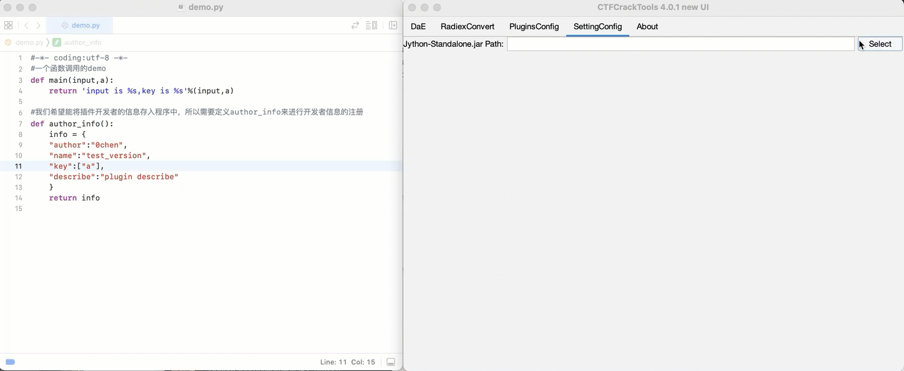

# CTFcrackTools-V4.0

[](https://travis-ci.org/0Chencc/CTFCrackTools)
[](https://github.com/0Chencc/CTFCrackTools/releases/latest)
[](https://raw.githubusercontent.com/0Chencc/CTFCrackTools/master/doc/LICENSE)
[](https://github.com/0Chencc/CTFCrackTools/releases)
[](https://github.com/0Chencc/CTFCrackTools/)

作者：林晨(0chen)

米斯特安全官网：http://www.acmesec.cn/

本工具已经可以作为burp插件导入，仓库地址：[DaE](https://github.com/0Chencc/DaE)

[请我喝一杯咖啡☕️](#要饭环节)

## 疑难解答

跳转到：[https://github.com/0Chencc/CTFCrackTools/wiki/FAQ](https://github.com/0Chencc/CTFCrackTools/wiki/FAQ)

## 界面介绍

主页面


添加插件



## 框架介绍

使用kotlin与java混合开发

这大概是国内首个应用于CTF的工具框架。

可以被应用于CTF中的Crypto，Misc...

内置目前主流密码（包括但不限于维吉利亚密码，凯撒密码，栅栏密码······）

用户可自主编写插件，但仅支持Python编写插件。编写方法也极为简单。(由于Jython自身的原因，暂时无法支持Python3)

在导入插件的时候一定要记得确认jython文件已经加载。

我们附带了一些插件在[现成插件](https://github.com/0Chencc/CTFCrackTools/tree/master/%E7%8E%B0%E6%88%90%E6%8F%92%E4%BB%B6)可供用户的使用

该项目一直在增强，这一次的重置只保留了部分核心代码，而将UI及优化代码重构，使这个框架支持更多功能。

项目地址：[https://github.com/0Chencc/CTFCrackTools](https://github.com/0Chencc/CTFCrackTools)

下载编译好的版本：[releases](https://github.com/0Chencc/CTFCrackTools/releases/)

##  插件编写


```Python
#-*- coding:utf-8 -*-
#一个函数调用的demo
def main(input,a):
    return 'input is %s,key is %s'%(input,a)
  
#我们希望能将插件开发者的信息存入程序中，所以需要定义author_info来进行开发者信息的注册
def author_info():
    info = {
    "author":"0chen",
    "name":"test_version",
    "key":["a"],
    "describe":"plugin describe"
    }
    return info
```

现在来具体讲下这些插件的用法，具体应该将下框架的调用方法。

**函数：** main

**描述：** 这个是程序调用插件时调用的函数。

定义：

```python
def main(input):
  return 'succ'
```

**函数：** author_info

**描述：** 我们希望能将插件开发者的信息存入程序中，所以需要定义author_info来进行开发者信息的注册

**author：** 作者信息

**name：** 插件名称

**key：** 考虑到会有某些特定的密码需要key，有时候需要多个key。所以可以注册key的信息，当程序调用的时候会进行弹框。

**describe：** 这个地方是插件的描述。由于python2的原因，似乎对中文的支持不是很全，建议大家使用英文来进行描述。

定义:

```python
def author_info():
    info = {
    "author":"0chen",
    "name":"test_version",
    "key":["a"],
    "describe":"plugin describe"
    }
    return info
```

**因为工具调用其实就是通过def mian(input)传入数据然后获取return的数据。**

```Python
#!/usr/bin/env python
# -*- coding: utf-8 -*-
def vigenereDecrypto(ciphertext,key):
    ascii='ABCDEFGHIJKLMNOPQRSTUVWXYZ'
    keylen=len(key)
    ctlen=len(ciphertext)
    plaintext = ''
    i = 0
    while i < ctlen:
        j = i % keylen
        k = ascii.index(key[j])
        m = ascii.index(ciphertext[i])
        if m < k:
            m += 26
        plaintext += ascii[m-k]
        i += 1
    return plaintext
def author_info:
  info = {
    'name':'VigenereDecrypto',
    'author':'naiquan',
    'key':'key',
    'describe':'VigenereDecrypto'
  }
def main(input,key):
    return vigenereDecrypto(input.replace(" ","").upper(),key.replace(" ","").upper())
```

多参数调用demo（注册传入函数只需要以string数组的形式注册即可，如demo所示）

```python
#-*- coding:utf-8 -*-
#多参数调用的demo
#abd分别为需要传入参数，基本上没有参数限制（没测过）
def main(input,a,b,c):
    return 'input is %s,key a is %s,key b is %s,key c is %s'%(input,a,b,c)
  
#我们希望能将插件开发者的信息存入程序中，所以需要定义author_info来进行开发者信息的注册
def author_info():
    info = {
    "author":"0chen",
    "name":"test_version",
    "key":["a","b","c"],
    "describe":"plugin describe"
    }
    return info
```


## 作者的碎碎念

​	作为一款自从2016年发布至今的工具，由于发布的时候，彼时作者在读高中，没有时间也没有能力去更新这样一款受众颇多的工具，这款工具到至今我收到了许多ctf初学者的感谢，因为近两年一直忙于生计，很难有时间去顾及到这款工具的发展，但是仍然会有许多朋友来联系我的qq和微信，对这款工具的发展提出宝贵的意见，这也是我时不时更新的动力。

​	我发现国内很多厂商都将这款工具作为ctf必备的工具加入到工具包中，非常感谢这些朋友的抬爱，也因为他们我的工具才能有上万人在使用。ctf圈子的氛围日益增长，希望这款工具也能跟随大家一直使用下去。

​	我在高二的时候参加了人生第一次ctf比赛，那时候被虐得体无完肤。当时我们留意到第一名在提交wp的时候也有这款工具的截图，让我非常开心。我希望这款工具能伴随各位ctfer的成长，如果有什么做得不够好的地方，欢迎大家在github的issue提供宝贵的意见，在力所能及的范围内我一定会采纳。

​	会一直坚持开源，也欢迎各位厂商继续采用我的工具作为新手必备的工具，感谢大家！

​	另外：米斯特安全团队一直在寻找优秀的CTF选手，如果有打算来我们团队发展的朋友可以联系邮箱：admin@hi-ourlife.com

## 旧版本

旧版本与新版本的差别仅仅在于ui的差别，最新的4.0版本抛弃了3.0被大家诟病的ui，并且在2.0也就是调查发现比较喜欢的版本的基础上进行了ui的美化，我认为旧版本已没有存在的必要，所以将项目设置为private，如果呼声过高我会重新开放。感谢大家。

~~[https://github.com/Acmesec/CTFCrackTools-V2](https://github.com/Acmesec/CTFCrackTools-V2)~~

## 要饭环节

我司承接各类安全培训以及渗透测试，可联系admin[#]hi-ourlife.com


