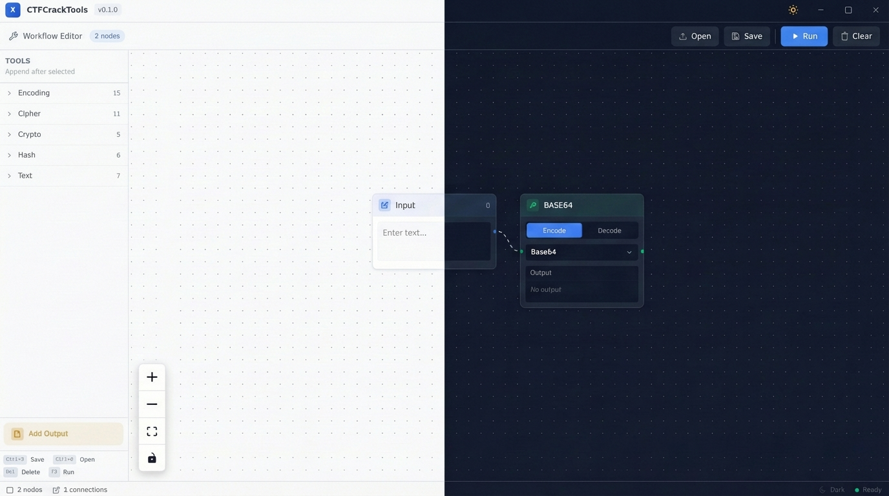

English | [简体中文](README.md)

# CTFCrackTools X

**Next-Generation Node-Based CTF Toolkit**

*From V4 to X — More Than Just a Version Number*

[Download](#download) | [Features](#features) | [Author's Note](#authors-note)

---

## Brand Evolution

**CTFCrackTools X** represents the next generation of CTFCrackTools. The "X" stands for:

- **eXtreme** — Ultimate performance and experience
- **eXtensible** — Modular node-based architecture
- **neXt** — Future-ready technology stack

| | CTFCrackTools V4 | CTFCrackTools X |
|---|---|---|
| Interface | Traditional forms | **Node-based workflow** |
| Performance | Java runtime | **Native performance** |
| Size | ~50MB+ | **<15MB** |
| Cross-platform | Requires JRE | **Native support** |

---

## Features

### Node-Based Workflow

Say goodbye to linear operations. Visually compose your encoding/decoding pipelines with drag-and-drop nodes.

1. **Download and install** the version for your system
2. **Launch the app** — you'll see a blank canvas
3. **Add nodes**: Input → Encoding nodes → Output
4. **Connect nodes**, enter your text, and execute

### 43+ Built-in Algorithms

Comprehensive coverage of encoding, encryption, and hashing commonly used in CTF challenges:

<b>Encoding (15)</b>

- Base64 / Base32 / Base58 / Base85
- Hex / URL / ASCII / Binary
- Morse / UUEncode / ROT47
- Unicode / HTML Entity
- JWT Decode / Brainfuck

<b>Classical Ciphers (11)</b>

- Caesar / ROT13 / Atbash
- Vigenère / Beaufort
- Playfair / Polybius
- Affine / Rail Fence
- Bacon / XOR

<b>Modern Encryption (5)</b>

- AES-128-CBC
- DES / 3DES
- Blowfish
- RC4

<b>Hash & KDF (6)</b>

- MD5 / SHA1 / SHA256 / SHA512
- HMAC-SHA256
- PBKDF2

<b>Text Processing (7)</b>

- Uppercase / Lowercase
- Reverse / Trim
- Capitalize / SwapCase
- Length

### Cross-Platform Support

Native support for Windows, macOS, and Linux — no runtime installation required.

---

## Download

Head to [Releases](https://github.com/0Chencc/CTFCrackTools/releases) to download the version for your system:

| Platform | Filename |
|----------|----------|
| Windows x64 | `ctfcracktools-x-windows-x64.exe` |
| macOS ARM64 | `ctfcracktools-x-macos-arm64` |
| Linux x64 | `ctfcracktools-x-linux-x64` |

> **Note**: macOS/Linux users need to add execute permission after download: `chmod +x ctfcracktools-x-*`

---

## Author's Note

For a long time, I received a lot of feedback about this tool. However, since I had been away from the CTF scene for quite a while, I kept putting off updates. This project also went through four major versions during my younger years when I didn't quite know what I was doing.

Many friends reached out to me about issues with the tool through my personal contacts rather than GitHub, which often led to me forgetting about them.

If I recall correctly, this tool was first released in 2016. I've cleaned up the commit history multiple times because back then I didn't know how to properly push code. In pursuit of cleaner, more standardized code, I kept overwriting the git history.

Now I've mastered git, but a decade has passed. I still remember that New Year's Eve ten years ago, coding away in Eclipse. How wonderful it would be if time could have stopped there.

Recently, I've been participating in or leading various projects driven by my interests. While going through my old projects, I came across this tool I wrote when I was 16, and I remembered the passion I had for solving CTF challenges late into the night. Admittedly, this tool isn't among the most outstanding in the open-source community — it's simply a beginner-friendly utility.

I've placed these words at the end, hoping that beyond the sentimentality, you can focus on the tool's functionality itself. I'm well aware that after ten years, this tool isn't exactly "excellent." That's why I hope to keep updating it so that it can be useful to everyone once again. Before starting this rewrite, I went back to read my own comments from years ago and searched for mentions of this tool online. I found bloggers still recommending it today, and write-ups still referencing it — that made me incredibly happy. Thank you all for your support over the years.

To give this tool a new lease on life in today's environment, I spent some time rebuilding it from the ground up with a completely new architecture. I hope you enjoy it.

Today, as I commit this code, it's December 25th, 2025 — Christmas Day. Merry Christmas to everyone.

**CTFCrackTools X** — *Perhaps it will be better than better*

Made with Rust + React by [0Chencc](https://github.com/0Chencc)

